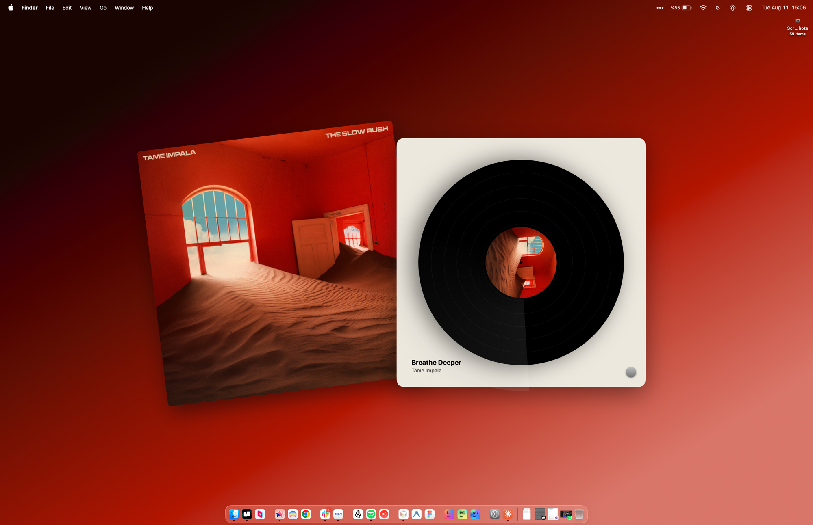
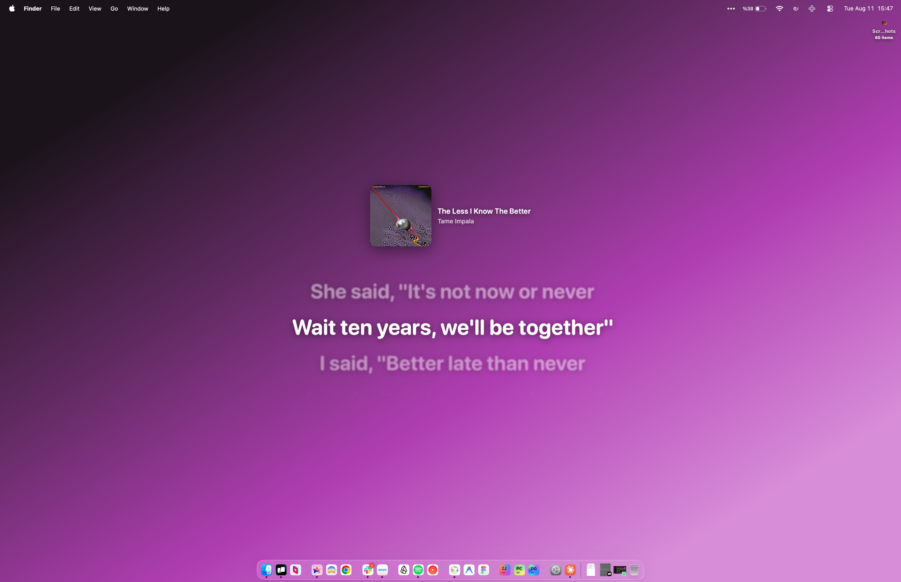

<div align="center">

# 🎧 Aftertone

### *The color of what you're listening to, left glowing on your desktop.*

Every album has a mood. Aftertone lifts it straight off the cover and lets it fill your
screen — a gradient that shifts with the music, lyrics that glow in time with the words,
art that never sits still. Your desktop stops being wallpaper and starts being the room
the song is playing in.

No windows. No Dock icon. No clutter. Just a menu bar icon — and a desktop that finally
sounds like something.

</div>

<p align="center">
  
  
</p>

<p align="center">

[](https://github.com/keremkesgin/aftertone/releases/latest)


</p>

---

## Features

- **Now Playing overlay** — album art, title, and artist as a small badge, positioned center or in any corner. Click-through: it never steals a click from your desktop.
- **Synced lyrics** — a `.lrc` next to a matched track (local, or fetched free from [lrclib.net](https://lrclib.net)) drives a scrolling, word-filled lyrics column, karaoke-style.
- **Vinyl Mode** — swap the badge for a spinning-record composition, art centered on the platter.
- **Gradient Wallpaper** — the whole desktop becomes a dark-to-light gradient built from the current album's dominant color, cross-fading between tracks. It also sets your real macOS wallpaper to match, so even the menu bar's own tint is correct — not just an on-screen overlay.
- **Theme Glow** — a soft, blurred wash of album color in the screen corners, adjustable in size.
- **Multi-display support** — pick which screen the overlay lives on, from a menu that always reflects what's actually connected.
- **Self-updating** — a **Check for Updates…** menu item (and one quiet check per launch) fetches the latest release, verifies it's genuinely signed by the maintainer, and installs it in place — no App Store, no manual re-download.

## Install

1. Grab the latest zip from **[Releases](https://github.com/keremkesgin/aftertone/releases/latest)**.
2. Unzip, drag `Aftertone.app` to `/Applications`.
3. Open it. Since it isn't notarized with an Apple Developer ID, Gatekeeper blocks the first launch. Two ways to get past it:
   - **Right-click → Open** — Control-click `Aftertone.app` and choose **Open**, then confirm in the dialog that appears.
   - **System Settings approval** — if you just double-clicked and got the "can't be opened" alert, open **System Settings → Privacy & Security**, scroll down to the security section, and you'll see *"Aftertone was blocked to protect your Mac"* with an **Open Anyway** button. Click it, then confirm with your password or Touch ID.

   Either way, this is only needed once — after the first approved launch, it opens normally.
4. Grant the Automation permission prompt when it appears — Aftertone reads now-playing info from Spotify via Apple Events, nothing else.
5. Click the menu bar icon to pick a position, turn on Vinyl Mode or Gradient Wallpaper, and adjust lyrics sync if it's ever a beat off.

**Requirements:** macOS 14+, the Spotify desktop app (not the web player).

## Checking for updates

Aftertone checks once, quietly, on every launch — if you're current, nothing happens. Pick
**Check for Updates…** from the menu bar any time to check on demand. When a newer build
is found, it downloads the release, verifies an Ed25519 signature over the archive against
a public key baked into the app, and only then replaces itself and relaunches. That
signature check — not Gatekeeper — is what keeps this safe: a plain in-app download never
carries the quarantine flag that triggers Gatekeeper's warning, so the signature is the
actual guarantee that what's being installed came from this repo's releases and nothing
else.

## Building from source

No Xcode required — this builds with Command Line Tools alone.

```sh
make app    # build + assemble + ad-hoc sign build/Aftertone.app
make run    # build and launch it
make test   # deterministic self-tests (parsing, clock, lyrics, settings, gradients…)
make clean
```

See [`docs/ARCHITECTURE.md`](docs/ARCHITECTURE.md) for how the pieces fit together —
the desktop-level window trick, the artwork/lyrics pipelines, and why updates are
hand-signed rather than delivered through Sparkle.

## License

[MIT](LICENSE).
